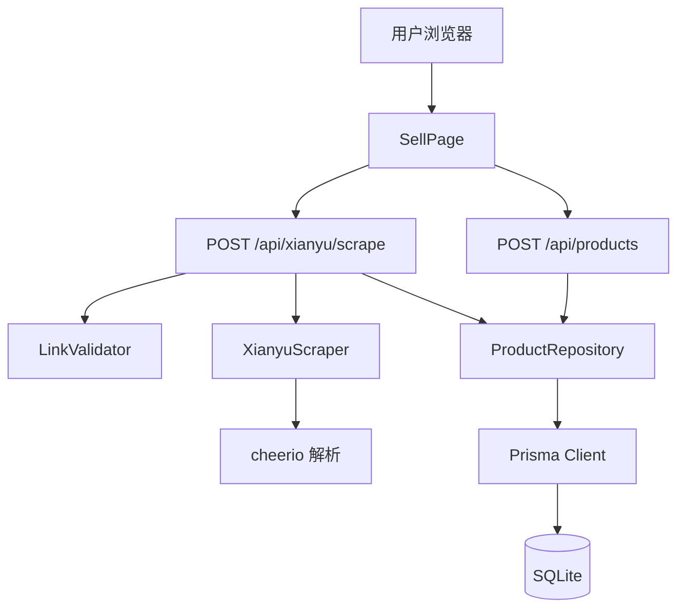
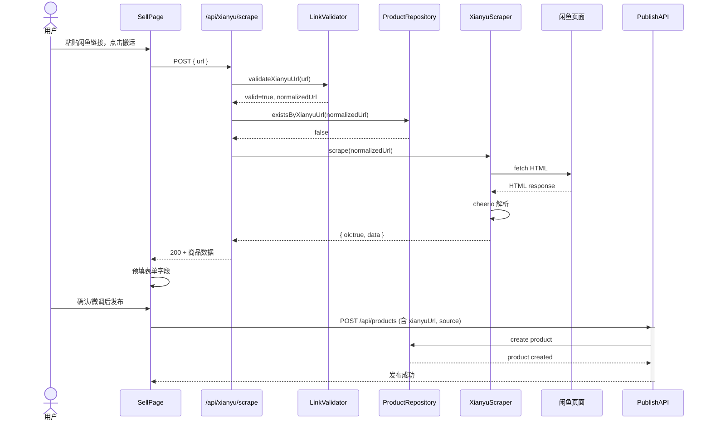

# 技术设计: 闲鱼商品搬运

## 概述

在现有 Next.js + Prisma + SQLite 技术栈基础上，新增闲鱼商品信息抓取与表单预填能力。用户在前端粘贴闲鱼链接，后端完成页面抓取与解析，返回结构化数据注入发布表单。

## 目标

- 将闲鱼商品上架流程从全手动录入缩短到"粘贴链接 → 确认发布"
- 复用现有 Product 模型与发布流程，最小化数据层改动
- 抓取逻辑与上层解耦，预留后续替换为 MCP Server 或第三方服务的扩展点

## 非目标

- 闲鱼自动化登录或 Cookie 池管理
- 视频、动态、信用分等非商品核心信息抓取
- 淘口令、短链接解析
- 平台商品反向发布到闲鱼
- 独立部署的抓取服务或 MCP Server（当前迭代内）

## 边界承诺

### 本 Spec 拥有
- 闲鱼商品详情页链接的格式验证与重复性检查
- 闲鱼页面的 HTTP 抓取与 HTML 结构化解析
- 解析结果的清洗、标准化与表单预填数据生成
- 发布时的 `source=xianyu` 标记与 `xianyuUrl` 持久化
- 抓取超时、反爬拦截、解析失败等异常场景的用户提示

### 本 Spec 不拥有
- 闲鱼账号体系、登录态管理、验证码处理
- 图片长期存储与 CDN 转存（仅传递 URL，防盗链由前端处理）
- AI 议价逻辑改动
- 管理员代购订单流程改动
- 任何非闲鱼平台（如转转、 eBay）的商品搬运

### 允许依赖
- Next.js App Router（API Route）
- Prisma ORM + SQLite
- 原生 `fetch`（HTTP 请求）
- `cheerio`（服务端 HTML 解析，轻量、无浏览器依赖）

### 重新验证触发器
- 闲鱼页面 DOM 结构或 CSS 类名发生显著变化
- 闲鱼反爬策略升级导致当前抓取成功率持续低于可接受阈值
- 需要支持视频、多规格SKU、拍卖等非标准商品页
- 需要引入图片转存或 MCP Server 替代方案

## 架构



## 文件结构计划

| 文件 | 职责 | 新建/修改 |
|------|------|-----------|
| `src/lib/xianyu-scraper.ts` | 抓取服务：HTTP 请求、HTML 解析、错误封装 | 新建 |
| `src/lib/types/xianyu.ts` | 共享类型：`XianyuItem`, `ScrapeError` | 新建 |
| `src/app/api/xianyu/scrape/route.ts` | API Route：链接验证、重复检测、调用抓取服务、返回 JSON | 新建 |
| `src/app/sell/page.tsx` | 前端页面：新增闲鱼链接输入区、加载态、预填表单、去重提示 | 修改 |

## 组件与接口

### XianyuScraper（Domain: Scraping）

**Intent**: 负责闲鱼商品页面的 HTTP 抓取与 HTML 结构化解析，输出平台可消费的标准商品数据。

**Requirements Coverage**: 2.4, 2.5, 2.6, 2.7, 2.8, 2.9

**Contracts**:
- Service Interface

**Interface**:
```typescript
interface XianyuScraper {
  scrape(url: string): Promise<ScrapeResult>
}

type ScrapeResult =
  | { ok: true; data: XianyuItem }
  | { ok: false; error: ScrapeErrorCode; message: string }

type ScrapeErrorCode =
  | 'FETCH_TIMEOUT'
  | 'FETCH_FAILED'
  | 'PARSE_FAILED'
  | 'NOT_PRODUCT_PAGE'

interface XianyuItem {
  title: string
  price: number
  description: string
  images: string[]
  condition?: '全新' | '几乎全新' | '轻微使用痕迹' | '明显使用痕迹'
}
```

**Error Handling**:
- 请求超时：30 秒硬性上限，抛出 `FETCH_TIMEOUT`
- HTTP 非 200：视为 `FETCH_FAILED`
- 页面缺少标题或价格节点：视为 `PARSE_FAILED`
- 解析异常：安全捕获，返回 `PARSE_FAILED`

**Implementation Notes**:
- 使用原生 `fetch` 请求闲鱼页面，携带标准浏览器 User-Agent
- 使用 `cheerio.load()` 将 HTML 加载为类 jQuery 对象，按 DOM 选择器提取字段
- 价格文本清洗：去除 "¥"、逗号、空白，解析为浮点数
- 成色映射规则：根据页面文案关键词映射到平台四项标准成色
- 图片提取：抓取主图区域 `img` 的 `src` 或 `data-src` 属性，过滤空值与重复值

---

### LinkValidator（Domain: Validation）

**Intent**: 校验闲鱼链接格式，拒绝非标准 URL。

**Requirements Coverage**: 1.1, 1.2

**Interface**:
```typescript
function validateXianyuUrl(url: string): { valid: boolean; normalized?: string }
```

**Rules**:
- 仅接受 `https://www.goofish.com/item?id=` 或 `https://m.goofish.com/item?id=` 格式
- 返回标准化后的 URL（统一使用 `https://www.goofish.com/item?id=...`）

---

### ProductRepository（Domain: Data）

**Intent**: 封装与 Product 表的数据访问，提供去重查询与创建能力。

**Requirements Coverage**: 1.3, 4.1, 4.2, 4.3, 6.2

**Interface**:
```typescript
interface ProductRepository {
  existsByXianyuUrl(url: string): Promise<boolean>
  // 复用现有 db.product.create，无需新增方法
}
```

**Implementation Notes**:
- `existsByXianyuUrl` 查询条件：`xianyuUrl: url, status: { not: 'deleted' }`
- 发布时由 `/api/products` 写入 `source='xianyu'` 和 `xianyuUrl`

---

### ScrapeAPI Route（Domain: API）

**Intent**: HTTP 入口，编排验证、去重、抓取流程。

**Requirements Coverage**: 1.1, 1.2, 1.3, 2.4, 6.1

**Contract**: REST API
- Method: `POST`
- Path: `/api/xianyu/scrape`
- Request Body: `{ url: string }`
- Response Body: `ScrapeResult`
- Status Codes:
  - `200` — 抓取成功
  - `400` — URL 格式无效
  - `409` — 该链接已存在于平台
  - `422` — 抓取成功但解析失败（页面结构不支持）
  - `504` — 抓取超时

---

### SellPage（Domain: UI）

**Intent**: 在现有发布表单上方增加闲鱼链接搬运入口，处理用户交互状态。

**Requirements Coverage**: 1.1, 3.1, 3.2, 3.3

**State Extensions**:
```typescript
interface SellFormState {
  // ... existing fields ...
  xianyuUrl: string
  isScraping: boolean
  scrapeError: string | null
}
```

**Flows**:
1. 用户粘贴链接 → 点击"搬运"按钮
2. 前端调用 `POST /api/xianyu/scrape`
3. 等待期间显示加载态（按钮 disabled + spinner）
4. 成功：将返回的 `title`, `price`, `description`, `images`, `condition` 注入表单状态
5. 失败：在链接输入区下方展示错误提示文案
6. 若返回 `409`：展示"该商品已存在于平台"提示，并提供跳转链接

---

## 数据模型

### 逻辑模型（复用现有 schema，无迁移）

`Product` 表已有字段：
- `xianyuUrl: String?` — 存储原始闲鱼链接
- `source: String?` — 写入 `"xianyu"` 表示搬运来源
- `status: String` — 发布后为 `"active"`

无需新增表或字段。发布接口 `/api/products` 只需在 body 中接受 `xianyuUrl` 和 `source` 并写入即可。

## 系统流程

### 流程：成功搬运



## 需求可追溯性

| Requirement | Summary | Components | Interfaces | Flows |
|-------------|---------|------------|------------|-------|
| 1.1 | 链接输入 | SellPage | UI State | 成功搬运 |
| 1.2 | 格式验证 | LinkValidator, ScrapeAPI | `validateXianyuUrl` | 成功搬运 |
| 1.3 | 重复检测 | ProductRepository, ScrapeAPI | `existsByXianyuUrl` | 成功搬运 |
| 2.4 | 抓取触发 | XianyuScraper, ScrapeAPI | `scrape` | 成功搬运 |
| 2.5 | 核心字段提取 | XianyuScraper | `XianyuItem` | 成功搬运 |
| 2.6 | 成色提取 | XianyuScraper | 内部映射规则 | 成功搬运 |
| 2.7 | 超时处理 | XianyuScraper | `FETCH_TIMEOUT` | — |
| 2.8 | 反爬/访问失败 | XianyuScraper | `FETCH_FAILED` | — |
| 2.9 | 解析失败 | XianyuScraper | `PARSE_FAILED` | — |
| 3.1 | 自动预填 | SellPage | UI State | 成功搬运 |
| 3.2 | 用户编辑保留 | SellPage | UI State | 成功搬运 |
| 3.3 | 图片展示与容错 | SellPage | UI State | 成功搬运 |
| 4.1 | 来源标记 | ProductRepository | `create`（扩展字段） | 成功搬运 |
| 4.2 | 价格校验 | SellPage / PublishAPI | 现有表单校验 | 成功搬运 |
| 4.3 | 图片数量校验 | SellPage / PublishAPI | 现有表单校验 | 成功搬运 |
| 5.1 | 不支持淘口令 | Boundary Commitments | — | — |
| 5.2 | 不支持视频/动态 | Boundary Commitments | — | — |
| 5.3 | 不支持反向上架 | Boundary Commitments | — | — |
| 6.1 | 响应时间 | ScrapeAPI | timeout=30s | — |
| 6.2 | 独立请求处理 | ProductRepository | unique index on xianyuUrl | — |

## 错误处理

| 场景 | 检测点 | 用户可见行为 | 日志级别 |
|------|--------|--------------|----------|
| URL 格式非法 | LinkValidator | 前端提示"请检查链接格式" | warn |
| 链接已存在 | ProductRepository | 前端提示"该商品已搬运" + 跳转入口 | info |
| 抓取超时 | XianyuScraper (AbortController) | 前端提示"抓取超时，请稍后重试" | error |
| HTTP 失败 | XianyuScraper | 前端提示"无法获取商品信息，请检查链接或手动填写" | error |
| 解析失败 | XianyuScraper | 前端提示"无法识别商品信息，请手动填写" | error |

## 测试策略

| 测试项 | 类型 | 验证内容 |
|--------|------|----------|
| 合法闲鱼链接抓取 | 集成测试 | 给定真实闲鱼链接，返回包含 title/price/images 的 `XianyuItem` |
| 非法链接拒绝 | 单元测试 | `validateXianyuUrl` 对非 goofish.com 域名返回 `valid=false` |
| 重复链接检测 | 集成测试 | 对已存在 `xianyuUrl` 的库调用 `existsByXianyuUrl` 返回 `true` |
| 解析容错 | 单元测试 | 对非商品 HTML 调用 `scrape` 返回 `PARSE_FAILED` |
| 前端预填流程 | E2E | 粘贴链接 → 点击搬运 → 表单字段被正确填充 |
| 错误提示展示 | E2E | 输入非法链接 → 前端展示对应错误文案 |

## 性能考量

- 抓取 API 设置 30 秒超时（AbortController），防止长连接阻塞
- 单次请求内存占用低（cheerio 解析字符串，无 headless 浏览器开销）
- 无额外数据库连接池压力（复用现有 Prisma 实例）

## 安全考量

- URL 严格白名单校验，仅允许 `goofish.com` 域名，防止 SSRF
- 不传递用户 Cookie 或鉴权信息到闲鱼，抓取为匿名请求
- 图片 URL 直接传递不做转存，降低存储与合规风险
- 抓取错误不暴露内部堆栈，仅返回标准化错误码与友好文案

## 迁移与部署

- 无数据库迁移（复用现有字段）
- 部署前需安装新依赖：`npm install cheerio`
- 无需额外环境变量或配置文件变更
